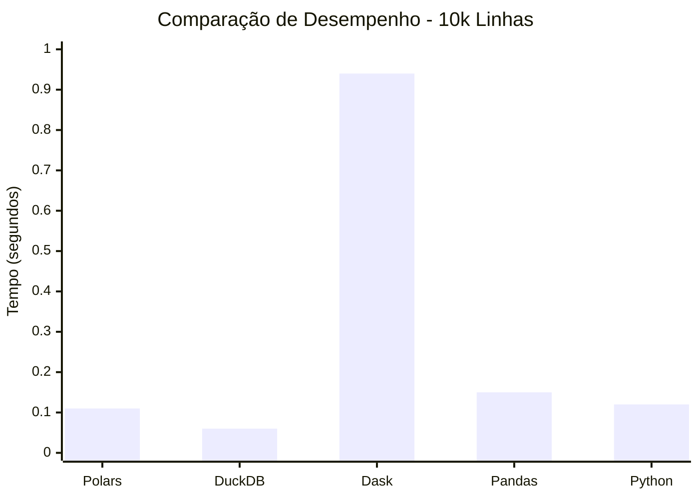
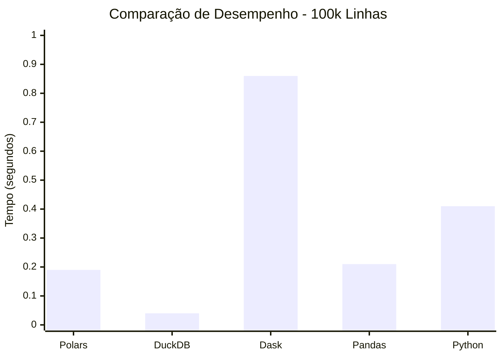
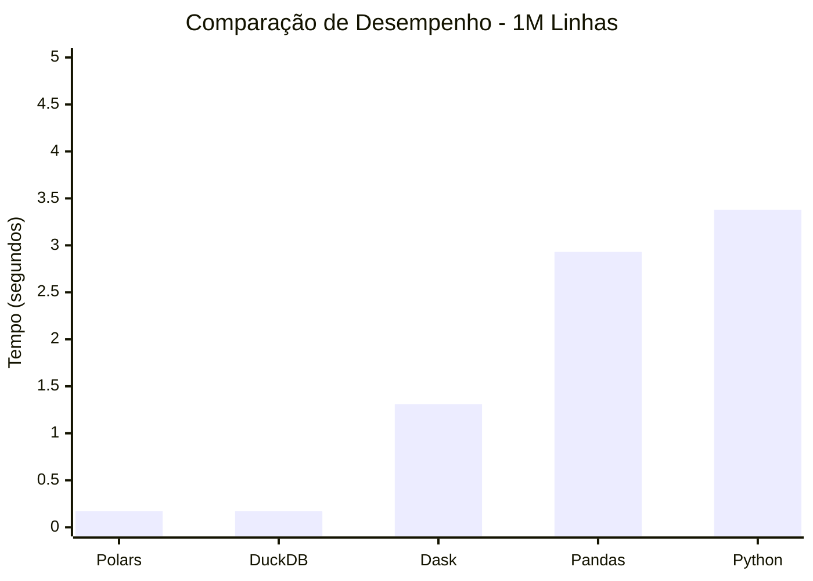
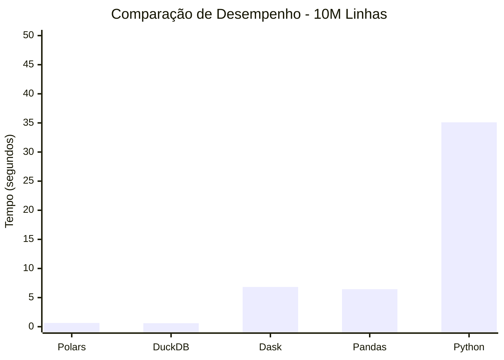
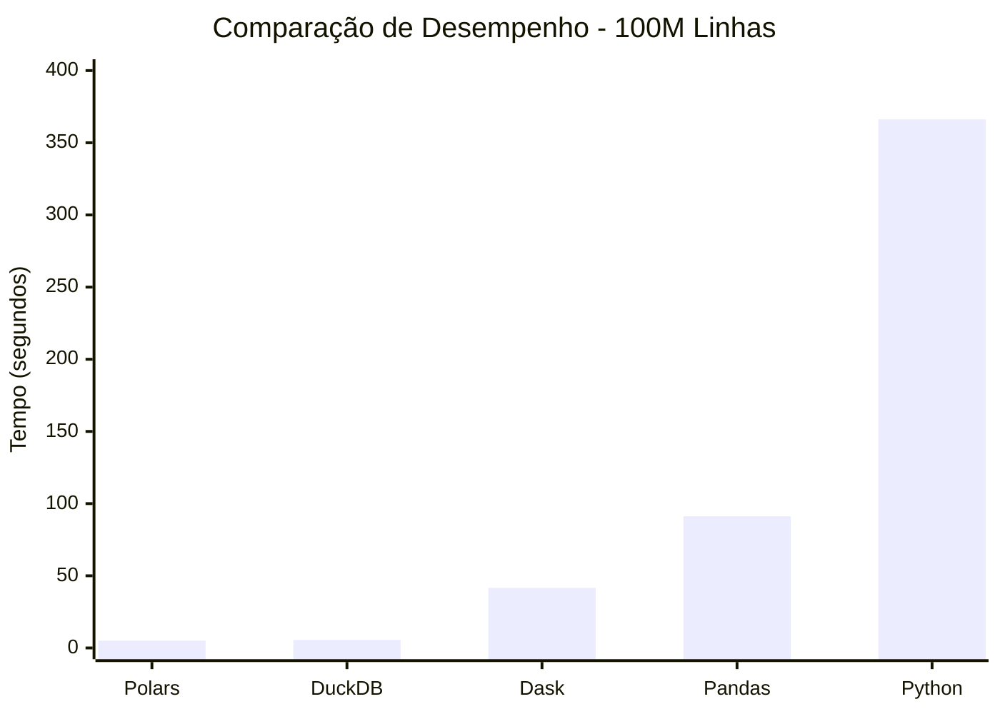
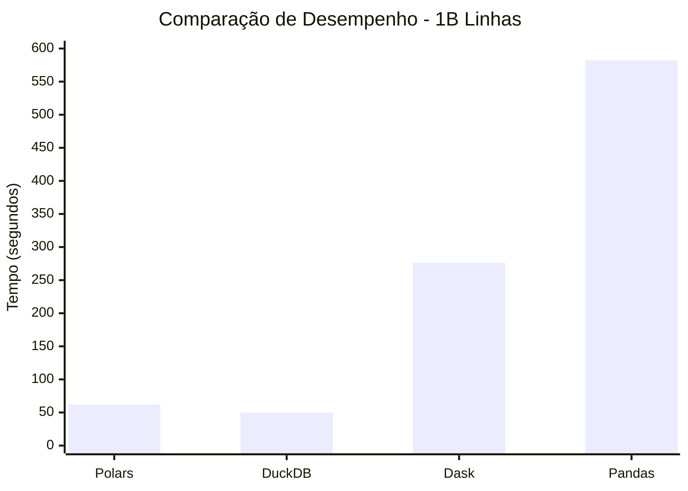

# Um Bilhão de Linhas: Desafio de Processamento de Dados com Python

## Introdução

O objetivo deste projeto é demonstrar como processar eficientemente um arquivo de dados massivo contendo 1 bilhão de linhas (~14GB), especificamente para calcular estatísticas (Incluindo agregação e ordenação que são operações pesadas) utilizando Python.

O desafio foi inspirado no [The One Billion Row Challenge](https://github.com/gunnarmorling/1brc), originalmente proposto para Java. Este projeto foi inspirado pelo projeto [One-Billion-Row-Challenge-Python](https://github.com/lvgalvao/One-Billion-Row-Challenge-Python), onde eu tomei a liberdade de testar tambem outros arquivos de tamanhos menores que 1 bilhão de linhas.

O arquivo de dados consiste em medições de temperatura de várias estações meteorológicas. Cada registro segue o formato `<string: nome da estação>;<double: medição>`, com a temperatura sendo apresentada com precisão de uma casa decimal.

Aqui estão dez linhas de exemplo do arquivo:

```
Hamburg;12.0
Bulawayo;8.9
Palembang;38.8
St. Johns;15.2
Cracow;12.6
Bridgetown;26.9
Istanbul;6.2
Roseau;34.4
Conakry;31.2
Istanbul;23.0
```

O desafio é desenvolver um programa Python capaz de ler esse arquivo e calcular a temperatura mínima, média (arredondada para uma casa decimal) e máxima para cada estação, exibindo os resultados em uma tabela ordenada por nome da estação.

| station      | min_temperature | mean_temperature | max_temperature |
|--------------|-----------------|------------------|-----------------|
| Abha         | -31.1           | 18.0             | 66.5            |
| Abidjan      | -25.9           | 26.0             | 74.6            |
| Abéché       | -19.8           | 29.4             | 79.9            |
| Accra        | -24.8           | 26.4             | 76.3            |
| Addis Ababa  | -31.8           | 16.0             | 63.9            |
| Adelaide     | -31.8           | 17.3             | 71.5            |
| Aden         | -19.6           | 29.1             | 78.3            |
| Ahvaz        | -24.0           | 25.4             | 72.6            |
| Albuquerque  | -35.0           | 14.0             | 61.9            |
| Alexandra    | -40.1           | 11.0             | 67.9            |
| ...          | ...             | ...              | ...             |
| Yangon       | -23.6           | 27.5             | 77.3            |
| Yaoundé      | -26.2           | 23.8             | 73.4            |
| Yellowknife  | -53.4           | -4.3             | 46.7            |
| Yerevan      | -38.6           | 12.4             | 62.8            |
| Yinchuan     | -45.2           | 9.0              | 56.9            |
| Zagreb       | -39.2           | 10.7             | 58.1            |
| Zanzibar City| -26.5           | 26.0             | 75.2            |
| Zürich       | -42.0           | 9.3              | 63.6            |
| Ürümqi       | -42.1           | 7.4              | 56.7            |
| İzmir        | -34.4           | 17.9             | 67.9            |

## Dependências

## Dependências Inicias

* [Docker](https://www.docker.com/) - não é obrigatório, a execução pode ser local.
* [UV](https://docs.astral.sh/uv/)

### Instalando o UV

1. Instale o pipx e pare de usar pip. (Você irá me agradecer depois.)

    ```bash
    pip install pipx
    ```

2. Instale o UV (Bye bye Poetry)

    ```bash
    pipx install uv
    ```

## Dependências de projeto

Para executar os scripts deste projeto, você precisará das seguintes bibliotecas:

* Polars: `1.17.1`
* DuckDB: `1.1.3`
* Dask[complete]: `^2024.12.0`
* Modin[dask]: `0.32.0`
* dask-expr: `1.1.20`
* Pandas: `2.2.3`
* python-dotenv: `1.0.1`
* tqdm: `4.67.1`

1. Apenas execute esse comando e o UV irá instalar as dependecias de maneira rapida.

```bash
    uv sync
```

## Observações iniciais

* As configurações inicias do meu computador:
  * Intel Core I7-8700 - 12 nucleos - 6 fisicos.
  * 16 GB RAM
  * HD SATA 1TB
  * __SSD 512 GB__

* __Docker__ - Eu utilizei ele porque acreditava que o Win11 estava interferindo nos benchmarks, devido às grandes divergências em comparação com os testes realizados por outros programadores. Eu achei que poderia ser algo relacionado com escalonamento de processos, ou má performance do python em multiprocessamento.

A verdade é que o Docker utilizado nos testes, em comparação com os testes locais, acabou interferindo negativamente nos resultados. No entanto, o desempenho foi melhor do que o esperado, pois percebi no final dos testes que o WSL2 estava instalado no meu SSD, e não no HD SATA (onde os testes locais estavam sendo executados e onde os meus projetos estavam armazenados). Infelizmente, só percebi isso ao final.

Ainda insistindo na  nessa situação de usar Docker, criei um volume no Docker e movi os arquivos necessários para a execução dos benchmarks para lá. Em seguida, construí uma imagem contendo os testes e suas dependências e executei como containers temporários. Com isso, obtive os resultados abaixo.

## Resultados do benchmark entre as ferramentas

### 10 mil linhas



| Implementação  | Tempo  |
| -------------- | ------ |
| Polars         | 0.11 sec |
| DuckDB         | 0.06 sec |
| Dask           | 0.94 sec |
| Pandas         | 0.15 sec |
| Python         | 0.12 sec |

### 100 mil linhas



| Implementação  | Tempo  |
| -------------- | ------ |
| Polars         | 0.19 sec |
| DuckDB         | 0.04 sec |
| Dask           | 0.86 sec |
| Pandas         | 0.21 sec |
| Python         | 0.41 sec |

### 1 milhão de linhas



| Implementação  | Tempo  |
| -------------- | ------ |
| Polars         | 0.17 sec |
| DuckDB         | 0.17 sec |
| Dask           | 1.31 sec |
| Pandas         | 2.93 sec |
| Python         | 3.38 sec |

### 10 milhões de linhas



| Implementação  | Tempo  |
| -------------- | ------ |
| Polars         | 0.64 sec |
| DuckDB         | 0.60 sec |
| Dask           | 6.83 sec |
| Pandas         | 6.44 sec |
| Python         | 35.11 sec |

### 100 milhões de linhas



| Implementação  | Tempo  |
| -------------- | ------ |
| Polars         | 5.02 sec |
| DuckDB         | 5.57 sec |
| Dask           | 41.65 sec |
| Pandas         | 91.24 sec |
| Python         | 366.20 sec |

### 1 bilhão de linhas



* _O script apenas com python não aguentou até o final. E o meu computador reniciou kkkk_

| Implementação  | Tempo  |
| -------------- | ------ |
| Polars         | 62.23 sec |
| DuckDB         | 49.94 sec |
| Dask           | 276.11 sec |
| Pandas         | 582.22 sec |
| Python         | (explodiu) |

## Conclusão

* O `DuckDB` foi o grande vencedor como esperando, acredito que refazendo todos os testes de forma local eu consiguirei resultados melhores, mas nada que mude a ordem dos vencedores.

* Usar __Pandas com chunks__ é burrice, use o __Polars__ ou qualquer uma das outras ferramentas. Principalmente para __Big Data__. Usar Pandas ou Python Puro que demandam uma série de gambiarras e inventar a roda novamente para implementar o processamento em "lotes"(chunks), __é perda de TEMPO__.

* Apesar de ser algo já conhecido da comunidade e nem era o fócuo dos testes, o Python não trabalha bem com multiprocessamento e varias threads, isso foi visivel no meu gerenciador de tarefas do Win11.

* Esses resultados enfatizam mais uma vez a importância de selecionar a ferramenta adequada para análise de dados em larga escala, demonstrando que Python, com as bibliotecas certas, é uma escolha poderosa para enfrentar desafios de big data.

Dask, Polars e DuckDB provaram ser excepcionalmente eficazes, requerendo menos linhas de código devido à sua capacidade inerente de distribuir os dados em "lotes em streaming" de maneira mais eficiente.

## Próximos passos

* RODAR NOVAMENTE O PROJETO COM SDD BOM, JUNTO COM O SPARK.
  